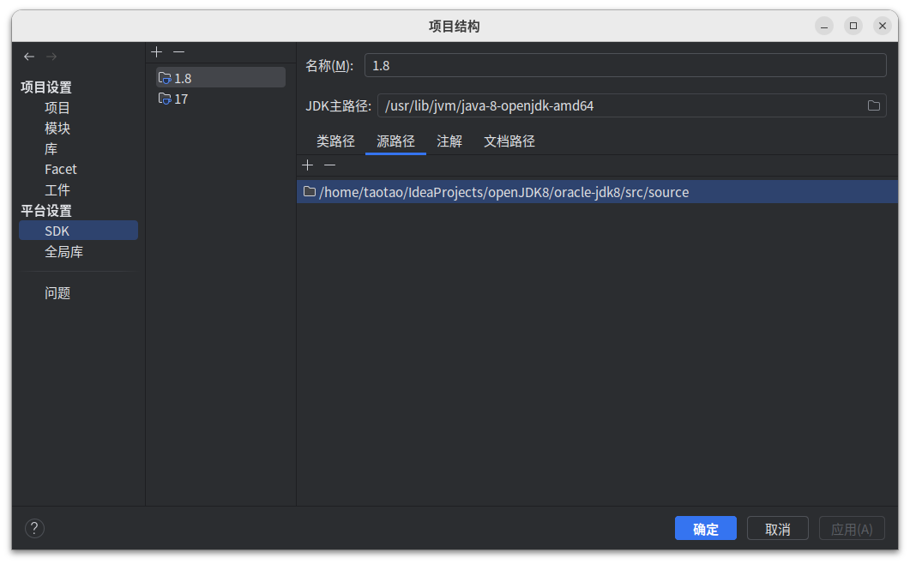
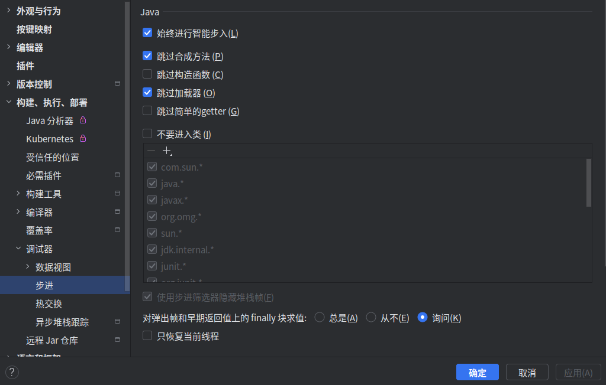

# openJDK8
JDK源码学习

JDK 镜像版本-openjdk-8u40-src-b25-10_feb_2015
## [openjdk-8u40](openjdk-8u40)
 - [common](openjdk-8u40/common)
 - [corba](openjdk-8u40/corba) - CORBA的实现
 - [hotspot](openjdk-8u40/hotspot) - hotspot虚拟机实现
 - [jaxp](openjdk-8u40/jaxp) JAXP的实现 提供处理XML的API
 - [jaxws](openjdk-8u40/jaxws) JAX-WS的实现 提供WebService的API
 - [jdk](openjdk-8u40/jdk) - Java类库实现
 - [langtools](openjdk-8u40/langtools) - 各种工具
 - [make](openjdk-8u40/make)
 - [nashorn](openjdk-8u40/nashorn) - JavaScript的实现
 - [test](openjdk-8u40/test)

## [目录结构](oracle-jdk8/src/source)
 - [sun](oracle-jdk8/src/source/com/sun) - 不关注
 - [java](oracle-jdk8/src/source/java) - 重点关注
   - [io](oracle-jdk8/src/source/java/io) - 文件流、网络流
   - [lang](oracle-jdk8/src/source/java/lang) - 基础语法和包装类型
   - [math](oracle-jdk8/src/source/java/math) - 函数
   - [net](oracle-jdk8/src/source/java/net) - 网络通讯
   - [nio](oracle-jdk8/src/source/java/nio) - 文件流、网络流
   - [time](oracle-jdk8/src/source/java/time) - 日期和时间
   - [util](oracle-jdk8/src/source/java/util) - 容器、集合、多线程、工具
 - [javax](oracle-jdk8/src/source/javax) - 不关注
 - [launcher](oracle-jdk8/src/source/launcher) - 不关注
 - [org](oracle-jdk8/src/source/org) - 不关注

- [Ubuntu22环境下编译OpenJDK12源码](https://blog.csdn.net/qq_25825005/article/details/127162939)
- [JDK源码下载Github](https://github.com/taotao1024/openJDK8.git)
- [环境构建](https://www.bilibili.com/video/BV1V7411U78L/)
- 
- 
